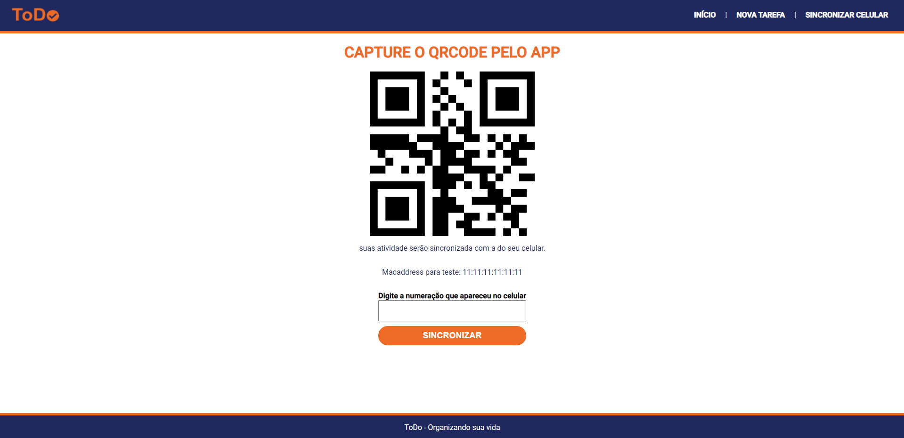
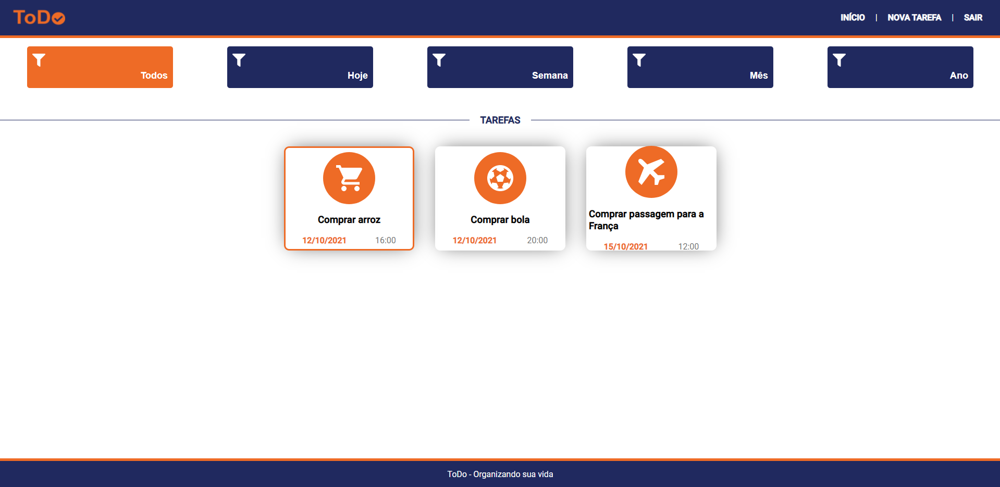
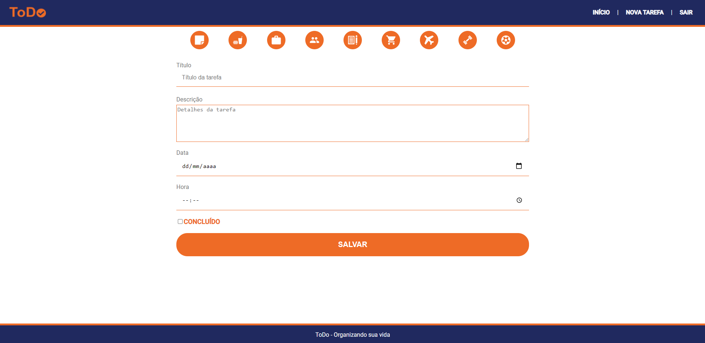

# toDo (Front-End)
Sistema simples de agendar tarefas. Este projeto foi desenvolvido com base no curso "Projeto Completo: XD, NodeJs, MongoDB, React Native e React" da Udemy.

Obs: O projeto não está finalizado, faltando a versão Mobile. Portanto, a geração de chaves QrCode está estático (o número pode ser pego usando o leitor de QrCode ou apenas copiando na página). Para testá-lo, é preciso da conexão com o MongoDB e a API (BackEnd) que também está no meu github. 

Deploy do projeto:
https://viniciuslima21.github.io/toDo-frontEnd/

Para visualizar em seu computador use: 

```
git clone https://github.com/viniciuslima21/toDo-frontEnd.git
```

## Tecnologias utilizadas
* Html
* CSS
* JavaScript
* React
    * Styled-domponents
    * Axios
    * Date-FNS
    * React-router-dom
    * QrCode-react

## Imagens do projeto


